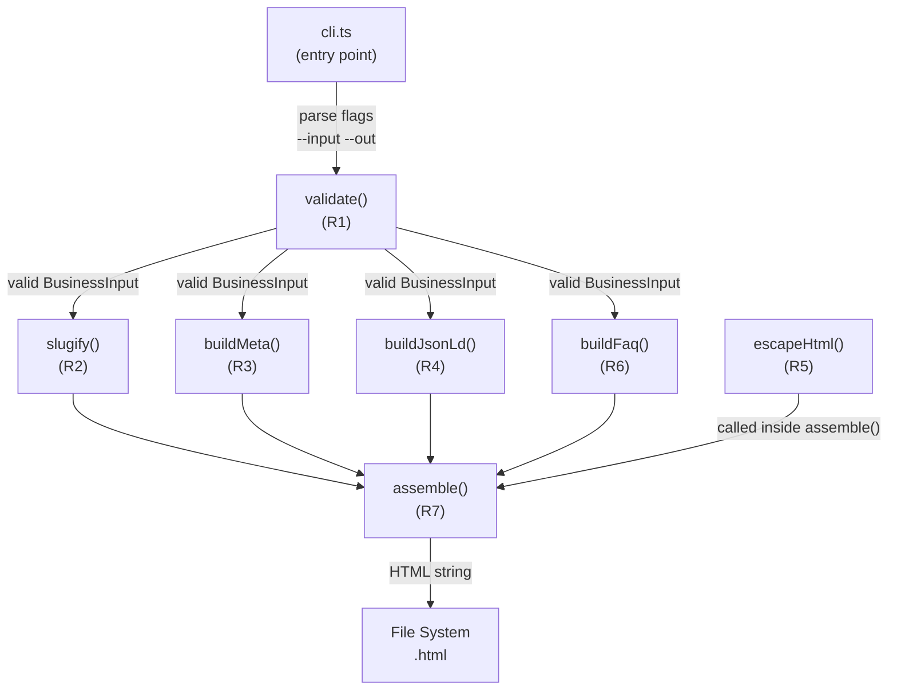

# Design Document: localpage-factory

## Overview

`localpage-factory` is a Node.js + TypeScript CLI tool that transforms a structured JSON
description of a local business into a publish-ready, self-contained HTML landing page
optimised for local SEO. A single invocation reads one JSON file, validates its content,
pipes it through a pipeline of pure transformation functions, and writes a single `.html`
file with no external dependencies.

The design centres on **pure functions with clear contracts**: each transformation (slug
generation, meta-tag production, JSON-LD construction, HTML escaping, FAQ generation) is
isolated in its own module, has no side effects, and is independently testable. The CLI
entry point and the HTML assembler are the only modules that touch the filesystem or
produce output; everything else is a deterministic value-to-value transformation.

---

## Architecture



Key architectural decisions:

- **All pure functions are called inside `assemble()`** rather than in `cli.ts` so that the
  assembler owns the complete rendering contract and can be unit-tested without spawning a
  process.
- **`escapeHtml()` is called at the injection site** inside `assemble.ts`, not upstream.
  This ensures it cannot be accidentally bypassed when new fields are added.
- **Determinism is a first-class constraint.** Every module that produces output for the
  HTML file must be deterministic. The output file is byte-for-byte identical for identical
  inputs (R7.11).
- **No external HTTP calls, no `<link>` stylesheets, no `<script>` tags except the single
  JSON-LD block** — the output file must be self-contained (R7.8, R7.9, R7.10).

---

## Components and Interfaces

### Module map

| File | Exported symbol | Responsibility |
|---|---|---|
| `src/slug.ts` | `slugify(name, city)` | R2 — derive URL-safe slug |
| `src/meta.ts` | `buildMeta(input)` | R3 — title tag + meta description |
| `src/jsonld.ts` | `buildJsonLd(input)` | R4 — schema.org JSON-LD object |
| `src/escape.ts` | `escapeHtml(s)` | R5 — HTML-escape user text |
| `src/faq.ts` | `buildFaq(input)` | R6 — FAQ question/answer array |
| `src/assemble.ts` | `assemble(input)` | R7 — compose all above into HTML |
| `src/validate.ts` | `validate(raw)` | R1 — validate + parse raw JSON |
| `src/cli.ts` | *(entry point)* | R8 — flag parsing, I/O, exit codes |

### Public function contracts

#### `slugify(businessName: string, city: string): string`

Accepts two non-empty, non-whitespace-only strings. Returns a lowercase, ASCII-letter/digit/
hyphen slug of the form `<processed-name>-<processed-city>`, at most 200 characters,
with no leading, trailing, or consecutive hyphens. Throws if either input is empty or
whitespace-only. Pure and deterministic.

#### `buildMeta(input: MetaInput): MetaResult`

Accepts `businessName`, `city`, `primaryService` (all non-empty strings) and an optional
`Tone`. Returns a `MetaResult` with `title` (≤ 60 chars) and `description` (≤ 155 chars).
Truncates at the nearest word boundary. City is always preserved verbatim in the title;
`businessName` is truncated first when both together exceed the budget. Throws if a required
field is absent, empty, or not a string. Pure and deterministic.

#### `buildJsonLd(input: JsonLdInput): JsonLdBlock`

Accepts `businessName`, `city`, `primaryService`, `phone` (required strings), and an
optional `reviews` array (max 100 `Review` objects). Returns a plain object conforming to
schema.org `LocalBusiness`. Throws if any required field is invalid or if any `Review` is
missing `author` or `text`. Pure and deterministic; `JSON.stringify` of the return value is
stable across calls with identical inputs.

#### `escapeHtml(s: string): string`

Accepts a string; replaces every `&`, `<`, `>`, `"`, `'` with the corresponding HTML
entity. Returns strings with no special characters unchanged. Throws `TypeError` for
non-string arguments. Pure, deterministic, and idempotent.

#### `buildFaq(input: FaqInput): FaqPair[]`

Accepts `primaryService` (1–100 chars), `city` (1–100 chars), and optional `Tone`. Returns
an array of 3–5 `FaqPair` objects, each with `question` (1–200 chars) and `answer`
(1–500 chars). Friendly/casual tone uses second-person ("you"/"your") in every answer;
professional/absent tone does not. Throws on invalid inputs. Pure and deterministic.

#### `assemble(input: BusinessInput): string`

Calls all pure functions, escapes every user-supplied string via `escapeHtml` before
injection, and returns the complete HTML document as a string. Pure and deterministic.

#### `validate(raw: unknown): BusinessInput`

Parses and validates an `unknown` value (typically from `JSON.parse`). Throws a structured
`ValidationError` naming each missing or invalid field. Returns a typed `BusinessInput`.

---

## Data Models

```typescript
/** The four valid tone values (undefined = professional default). */
type Tone = "professional" | "friendly" | "casual";

/** A customer testimonial, as supplied in the input JSON. */
interface Review {
  author: string; // non-empty
  text: string;   // non-empty
}

/** The raw Business_Input structure read from --input JSON. */
interface BusinessInput {
  businessName: string;    // required, non-empty
  city: string;            // required, non-empty
  primaryService: string;  // required, non-empty
  phone: string;           // required, non-empty
  tone?: Tone;             // optional, defaults to "professional"
  reviews?: Review[];      // optional, max 100 items
}

/** Subset of BusinessInput needed by buildMeta. */
interface MetaInput {
  businessName: string;
  city: string;
  primaryService: string;
  tone?: Tone;
}

/** Return value of buildMeta. */
interface MetaResult {
  title: string;       // ≤ 60 characters
  description: string; // ≤ 155 characters
}

/** Input subset for buildJsonLd. */
interface JsonLdInput {
  businessName: string;
  city: string;
  primaryService: string;
  phone: string;
  reviews?: Review[];
}

/** schema.org LocalBusiness object (plain, JSON-serialisable). */
interface JsonLdBlock {
  "@context": "https://schema.org";
  "@type": "LocalBusiness";
  name: string;
  telephone: string;
  areaServed: string;
  description: string;
  review?: Array<{ author: string; reviewBody: string }>;
}

/** Input subset for buildFaq. */
interface FaqInput {
  primaryService: string;
  city: string;
  tone?: Tone;
}

/** One question/answer pair in the FAQ block. */
interface FaqPair {
  question: string; // 1–200 characters
  answer: string;   // 1–500 characters
}
```

### Key data-flow invariants

- Every `string` field from `BusinessInput` that appears in the HTML output passes through
  `escapeHtml` inside `assemble()`.
- `BusinessInput` is immutable after `validate()` returns — downstream functions receive it
  read-only and return new values.
- `JsonLdBlock` is serialised with `JSON.stringify` exactly once inside `assemble()`, placed
  inside `<script type="application/ld+json">`.

---

## Correctness Properties

*A property is a characteristic or behavior that should hold true across all valid
executions of a system — essentially, a formal statement about what the system should do.
Properties serve as the bridge between human-readable specifications and machine-verifiable
correctness guarantees.*

---

### Property 1: Validation rejects every individually missing required field

*For any* valid `BusinessInput` object, independently removing each of the four required
fields (`businessName`, `city`, `primaryService`, `phone`) and passing the resulting object
to `validate()` SHALL cause `validate()` to throw an error whose message names the removed
field, and the error SHALL be thrown for every field removal.

**Validates: Requirements 1.1, 1.2, 1.3, 1.4**

---

### Property 2: Validation accepts all well-formed inputs

*For any* `BusinessInput` in which every required field is a non-empty, non-whitespace-only
string, `validate()` SHALL return without throwing.

**Validates: Requirement 1.5**

---

### Property 3: Slug output is lowercase, ASCII-safe, and structurally clean

*For any* pair of non-empty, non-whitespace-only strings `businessName` and `city`,
`slugify(businessName, city)` SHALL return a string that:
- contains only characters matching `[a-z0-9-]`,
- does not start or end with a hyphen,
- does not contain two or more consecutive hyphens,
- has length ≤ 200.

**Validates: Requirements 2.2, 2.3, 2.4, 2.7, 2.8, 2.10**

---

### Property 4: Slug is deterministic

*For any* valid pair of inputs, calling `slugify` twice SHALL return the same value both
times.

**Validates: Requirement 2.6**

---

### Property 5: Slug rejects blank inputs

*For any* string that is empty or composed entirely of whitespace characters, passing it as
either the `businessName` or `city` argument to `slugify` SHALL cause `slugify` to throw.

**Validates: Requirement 2.9**

---

### Property 6: Title tag length is always within budget

*For any* valid `MetaInput`, `buildMeta(input).title` SHALL have length ≤ 60.

**Validates: Requirement 3.2**

---

### Property 7: Meta description length is always within budget

*For any* valid `MetaInput`, `buildMeta(input).description` SHALL have length ≤ 155.

**Validates: Requirement 3.3**

---

### Property 8: City is always preserved verbatim in the title tag

*For any* valid `MetaInput` in which `city` is at most 55 characters (leaving room for the
separator and a minimal `businessName`), `buildMeta(input).title` SHALL contain the exact
value of `city`.

**Validates: Requirements 3.5, 3.11**

---

### Property 9: Meta output is deterministic

*For any* valid `MetaInput`, calling `buildMeta` twice with identical arguments SHALL return
`MetaResult` objects with equal `title` and `description` values.

**Validates: Requirement 3.7**

---

### Property 10: JSON-LD output has correct schema.org fields

*For any* valid `JsonLdInput`, `buildJsonLd(input)` SHALL return an object where
`["@context"] === "https://schema.org"`, `["@type"] === "LocalBusiness"`,
`name === input.businessName`, `telephone === input.phone`,
`areaServed === input.city`, and `description === input.primaryService`.

**Validates: Requirements 4.2, 4.3, 4.4, 4.5, 4.6, 4.7**

---

### Property 11: JSON-LD review array mirrors input reviews

*For any* valid `JsonLdInput` with a non-empty `reviews` array of 1–100 `Review` objects,
`buildJsonLd(input).review` SHALL be an array of the same length in which each element has
`author` equal to `reviews[i].author` and `reviewBody` equal to `reviews[i].text`.

**Validates: Requirement 4.8**

---

### Property 12: JSON-LD serialisation is stable (round-trip)

*For any* valid `JsonLdInput`, calling `buildJsonLd` twice and stringifying both results
SHALL produce the same JSON string: `JSON.stringify(buildJsonLd(x)) ===
JSON.stringify(buildJsonLd(x))`. Furthermore, `JSON.parse(JSON.stringify(buildJsonLd(x)))`
SHALL deeply equal `buildJsonLd(x)`.

**Validates: Requirements 4.11, 9.1**

---

### Property 13: HTML escaping replaces all five dangerous characters

*For any* string `s` containing any combination of `&`, `<`, `>`, `"`, `'` mixed with
arbitrary safe characters, `escapeHtml(s)` SHALL contain none of the five raw special
characters and each occurrence SHALL be replaced with its corresponding HTML entity
(`&amp;`, `&lt;`, `&gt;`, `&quot;`, `&#39;`).

**Validates: Requirement 5.1**

---

### Property 14: HTML escaping is the identity on safe inputs

*For any* string composed entirely of characters not in `{&, <, >, ", '}`,
`escapeHtml(s) === s`.

**Validates: Requirement 5.2**

---

### Property 15: Assembled HTML contains no raw special characters from user input

*For any* `BusinessInput` whose string fields each contain all five special characters
(`& < > " '`), the string returned by `assemble(input)` SHALL contain none of those raw
characters in the regions of the document derived from user-supplied text (outside the
`<script type="application/ld+json">` block, which uses JSON encoding).

**Validates: Requirement 5.5**

---

### Property 16: FAQ count is always between 3 and 5

*For any* valid `FaqInput`, `buildFaq(input)` SHALL return an array with length in the
closed interval [3, 5].

**Validates: Requirements 6.2, 6.3**

---

### Property 17: FAQ pairs have non-empty, length-bounded content

*For any* valid `FaqInput`, every element of `buildFaq(input)` SHALL have a `question` of
1–200 characters and an `answer` of 1–500 characters.

**Validates: Requirement 6.4**

---

### Property 18: FAQ tone routing — friendly/casual uses second-person

*For any* valid `FaqInput` with `tone` equal to `"friendly"` or `"casual"`, every `answer`
in `buildFaq(input)` SHALL match the regular expression `/\byou\b|\byour\b/i`.

**Validates: Requirement 6.6**

---

### Property 19: FAQ tone routing — professional/absent avoids second-person

*For any* valid `FaqInput` with `tone` equal to `"professional"` or `tone` absent, no
`answer` in `buildFaq(input)` SHALL match `/\byou\b|\byour\b/i`.

**Validates: Requirement 6.7**

---

### Property 20: FAQ output is deterministic

*For any* valid `FaqInput`, calling `buildFaq` twice with identical arguments SHALL return
arrays that are deeply equal.

**Validates: Requirement 6.5**

---

### Property 21: Assembled HTML is structurally valid and self-contained

*For any* valid `BusinessInput`, the string returned by `assemble(input)` SHALL:
- begin with `<!DOCTYPE html>`,
- contain a `<title>` element in the `<head>` whose text matches `buildMeta(input).title`,
- contain a `<meta name="description">` element whose `content` matches
  `buildMeta(input).description`,
- contain exactly one `<script type="application/ld+json">` element in the `<head>`,
- contain a `<style>` element in the `<head>` and no `<link rel="stylesheet">` elements,
- contain no `on*` attributes,
- contain no other `<script>` elements.

**Validates: Requirements 7.2, 7.3, 7.4, 7.5, 7.8, 7.9, 7.10**

---

### Property 22: Assembly is deterministic (byte-identical on identical input)

*For any* valid `BusinessInput`, calling `assemble(input)` twice SHALL return the same
string both times.

**Validates: Requirement 7.11**

---

### Property 23: Business_Input JSON round-trip

*For any* valid `BusinessInput` object `b`, the result of
`validate(JSON.parse(JSON.stringify(b)))` SHALL produce a `BusinessInput` object whose
every field is identical in type and value to `b`.

**Validates: Requirement 9.2**

---

## Error Handling

### Validation errors (R1)

`validate()` throws a `ValidationError` (subclass of `Error`) with `field` and `message`
properties. The CLI catches this, writes the message to `stderr`, and exits with code 1.

### Function-level errors (R2–R6)

Each pure function throws a standard `Error` with a descriptive message when its
preconditions are violated (blank inputs, out-of-range values, unrecognised tone). No
partial objects are returned. The CLI catches these and routes them to `stderr` with exit
code 1.

### File-system errors (R7.13, R8)

- **Missing `--input` file**: `ENOENT` from `fs.readFileSync` is caught; the error message
  includes the attempted path.
- **Invalid JSON**: `JSON.parse` throws `SyntaxError`; the CLI wraps this with the file
  path.
- **`--out` directory cannot be created**: `fs.mkdirSync` throws; the CLI catches and
  prints the directory path.
- **`--out` path is an existing file**: checked before `mkdirSync` via `fs.statSync`;
  exits with a descriptive error.

All error output goes to `stderr`. All success output (absolute path of written file) goes
to `stdout`. Exit code `0` on success, non-zero (`1`) on any error.

---

## Testing Strategy

### Property-based testing (fast-check)

The project uses [fast-check](https://fast-check.io) for property-based tests. Each pure
function module has a corresponding `*.property.test.ts` file.

**Library choice rationale:** fast-check is the most mature TypeScript-native PBT library,
supports shrinking, and runs in Jest/Vitest without extra configuration.

Each property test:
- Runs a minimum of **100 iterations** per property.
- Is tagged with a comment referencing the design property it validates, in the format:
  `// Feature: localpage-factory, Property N: <property text>`

#### Generators

| Generator | Used for |
|---|---|
| `fc.string()` / `fc.unicodeString()` | arbitrary text inputs |
| `fc.stringOf(fc.char())` with filter for non-empty | non-empty strings |
| `fc.string({ minLength: 1, maxLength: 100 })` | bounded-length inputs |
| `fc.constantFrom("professional","friendly","casual")` | Tone values |
| `fc.array(reviewArb, { minLength: 1, maxLength: 100 })` | Review arrays |
| Custom `businessInputArb` | fully valid BusinessInput |

#### Property test files

| File | Properties covered |
|---|---|
| `src/__tests__/slug.property.test.ts` | Properties 3, 4, 5 |
| `src/__tests__/meta.property.test.ts` | Properties 6, 7, 8, 9 |
| `src/__tests__/jsonld.property.test.ts` | Properties 10, 11, 12 |
| `src/__tests__/escape.property.test.ts` | Properties 13, 14 |
| `src/__tests__/faq.property.test.ts` | Properties 16, 17, 18, 19, 20 |
| `src/__tests__/assemble.property.test.ts` | Properties 1, 2, 15, 21, 22, 23 |

### Example-based unit tests

Example-based tests (`*.test.ts`) cover:

- Specific truncation examples for slug (R2.10) and meta (R3.8, R3.9, R3.11)
- All five HTML entities individually (R5.1)
- FAQ edge cases: exactly 3 pairs, exactly 5 pairs
- CLI flag omission: `--input` absent, `--out` absent (R1.6, R1.7)
- Invalid JSON input file (R1.9)
- `--out` path pointing to an existing file (R8.8)
- Silent overwrite of existing output file (R7.14)

### Integration tests

Integration tests (`src/__tests__/cli.integration.test.ts`) spawn `node dist/cli.js`
as a child process and assert:

- Exit code `0` + absolute output path on `stdout` for valid input (R8.4)
- Exit code non-zero + message on `stderr` for each error case (R8.5)
- Output file exists at `<outDir>/<slug>.html` after successful run (R7.1)
- Output directory is created when it does not exist (R8.3)

These tests operate on 2–3 representative examples each; they do not use property
generators (spawning a subprocess 100 times per property would be slow and tests external
I/O rather than our logic).

### Test file structure

```
src/
  __tests__/
    slug.property.test.ts
    slug.test.ts
    meta.property.test.ts
    meta.test.ts
    jsonld.property.test.ts
    jsonld.test.ts
    escape.property.test.ts
    escape.test.ts
    faq.property.test.ts
    faq.test.ts
    assemble.property.test.ts
    assemble.test.ts
    validate.test.ts
    cli.integration.test.ts
```

### CLI flag parsing

The CLI uses Node's built-in `util.parseArgs` (available since Node 18) with a declarative
option schema:

```typescript
const { values } = parseArgs({
  options: {
    input: { type: "string", short: "i" },
    out:   { type: "string", short: "o" },
    help:  { type: "boolean", short: "h" },
  },
  strict: true,
});
```

`strict: true` causes `parseArgs` to throw on unknown flags, which the CLI catches and
routes to a usage message. This avoids pulling in a third-party flag-parsing dependency.
